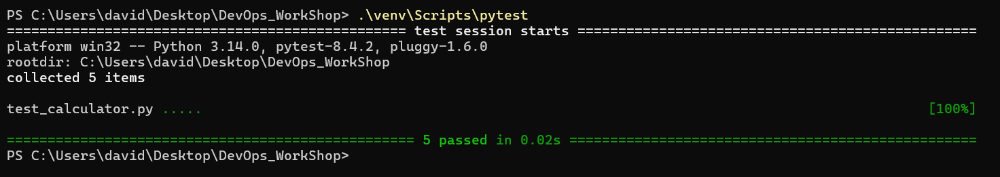
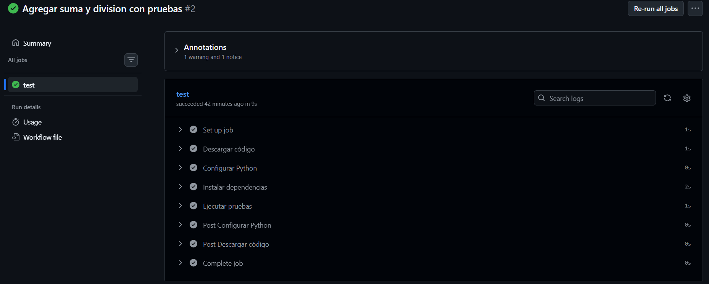
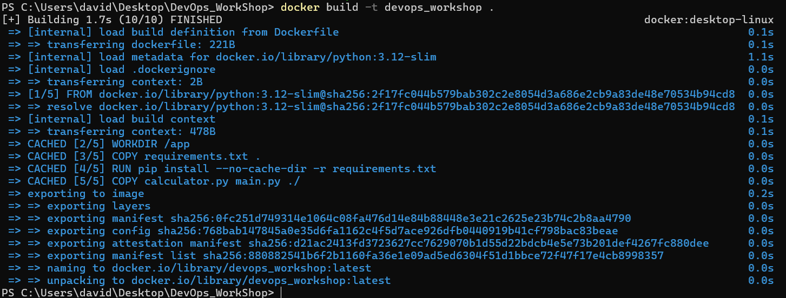
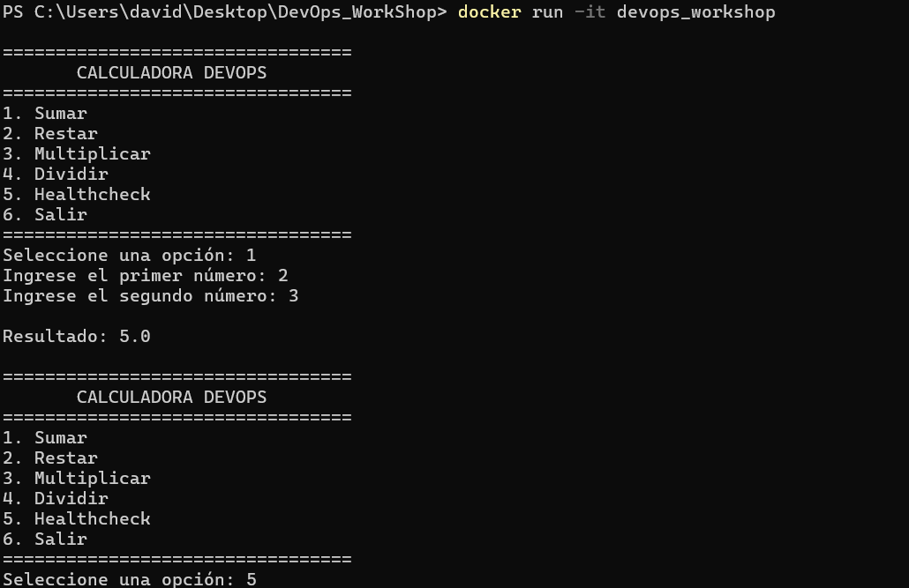
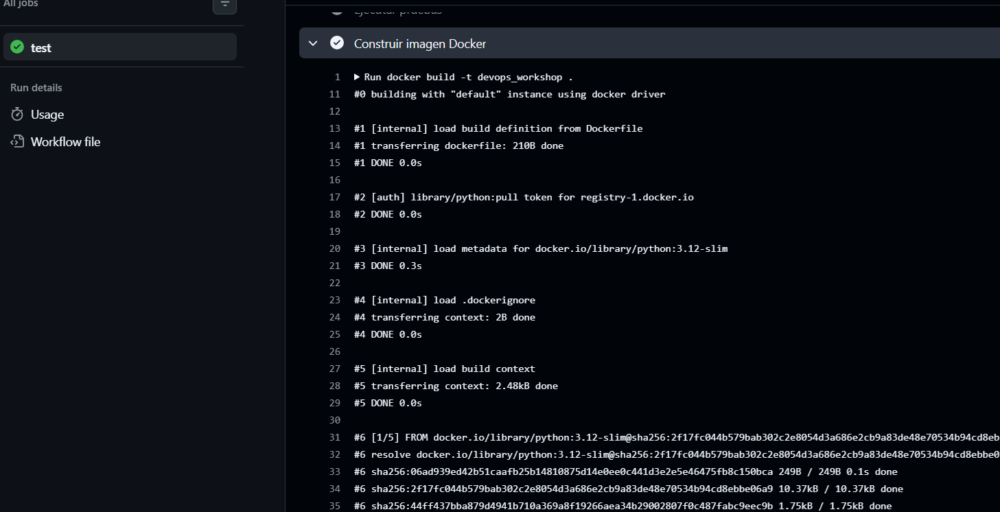
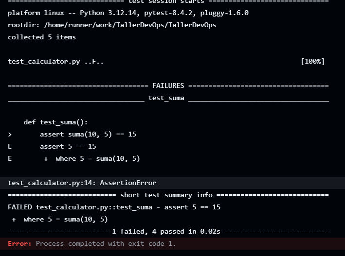
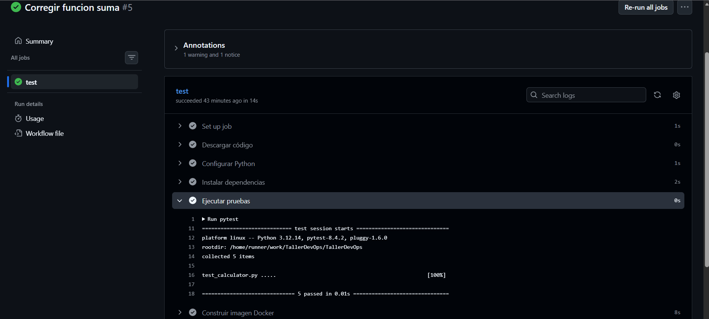

# Solución del Taller DevOps: De Código a Producción

Este documento representa el informe final del taller práctico, demostrando el flujo completo de entrega de software mediante control de versiones, pruebas automatizadas, Integración Continua (CI) y contenerización con Docker.

## 1. Funcionalidades y Pruebas

Se añadieron las funciones `suma` y `division` en el archivo `calculator.py`, asegurando el manejo de errores (como la división por cero). Además, se implementaron sus respectivas pruebas automatizadas en `test_calculator.py`.

### Evidencia 1
A continuación se muestra el código implementado y la ejecución local exitosa de `pytest` con las 5 pruebas pasando.

---

## 2. Pipeline Exitoso (GitHub Actions)

Una vez empujado el código, GitHub Actions ejecutó el flujo de Integración Continua definido en `.github/workflows/ci.yml`.

### Evidencia 2
Captura del pipeline de GitHub Actions ejecutando correctamente las pruebas tras el primer commit de funcionalidades.

---

## 3. Construcción de la Imagen Docker

Se utilizó el `Dockerfile` provisto para empaquetar la aplicación y sus dependencias.

### Evidencia 3
Construcción exitosa de la imagen Docker en el entorno local (`docker build -t devops_workshop .`).

---

## 4. Aplicación ejecutándose en Docker

Se verificó el correcto funcionamiento de la calculadora aislada dentro de un contenedor.

### Evidencia 4
Calculadora y healthcheck funcionando dentro del contenedor (`docker run -it devops_workshop`).

---

## 5. Pipeline con Integración de Docker

Se actualizó el flujo de trabajo (`ci.yml`) para incluir el paso de construcción de la imagen Docker después de que las pruebas automatizadas fuesen exitosas.

### Evidencia 5
Pruebas y construcción de Docker ejecutándose correctamente en GitHub Actions.

---

## 6. Detección de Errores (Pipeline Fallido)

Se introdujo un error intencional en la función de suma (`return a - b`) para comprobar la eficacia de las pruebas y la CI.

### Evidencia 6
El pipeline falló y detuvo el proceso debido a que la prueba automatizada detectó la discrepancia.

---

## 7. Corrección y Pipeline Exitoso

Se corrigió la función nuevamente a `return a + b`, restaurando el correcto funcionamiento.

### Evidencia 7
Pipeline exitoso después de solucionar el error, completando el ciclo de retroalimentación de CI/CD.

---

## Reflexión Final

> **¿Qué aprendí durante el taller sobre DevOps y cómo contribuyen el control de versiones, las pruebas automatizadas, la Integración Continua, la automatización y Docker al proceso de entrega de software?**
>
> Durante este taller aprendí que DevOps no se trata solo de herramientas, sino de crear un flujo de trabajo confiable. El control de versiones (Git) nos dio un historial seguro, mientras que las pruebas automatizadas (pytest) y la Integración Continua (GitHub Actions) nos permitieron detectar y corregir errores automáticamente antes de que lleguen a producción (como vimos al introducir el fallo intencional). Finalmente, la automatización junto con Docker nos garantizó que la aplicación se entregue y ejecute en cualquier entorno sin problemas de dependencias.
